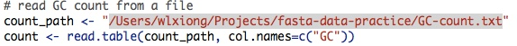
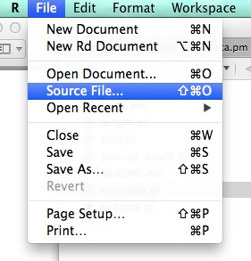
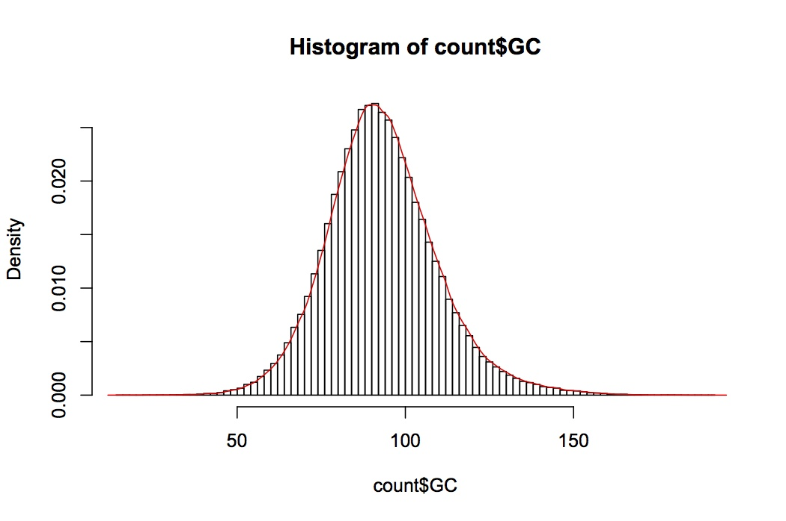

# 练习题

scaffold：plum_0630.scafSeq.FG和gene注释结果(Prunus_mume_scaffold.gff)下操作：

* 统计scaffold.fa染色体基本信息，输出的内容与格式如下结果，输出成文本文件。

Name        |  Total Length |  Effective Length |  N Length |  GC Length |  GC Rate (%) |
------------|---------------|-------------------|-----------|------------|--------------|
scaffold.fa |               |                   |           |            |              |


* 计算scaffold.fa的N50 ，N90；（N50定义google）

* 以250bp为窗口，无重叠的沿序列滑动，计算GC含量，用R或者SVG做出GC含量分布曲线

* 根据序列scaffold.fa以及基因注释文件scaffold.glimmer.gff，提取scaffold.fa上的所有的基因的CDS序列，结果以fa格式输出；（gff文件的格式google一下就知道每列意义）

* 将提取的CDS序列翻译成氨基酸序列，结果以fa格式输出。（三联体密码子对应的氨基酸自己建hash）计算scaffold.fa的N50 ；（N50定义google）

# How to run

First, open Terminal.app or iTerm2.app and change to the ```src/``` directory:

    cd src/

All the following commands are run in this directory.

## Lengths

All the length values will be shown on screen.

    $ ./length.pl
    Total Length: 60233856
    Effective Length: 57637416
    N Length: 2596440
    GC Length: 21508836
    GC Rate: 0.357088810651604

## N50, N90

N50 and N90 will be shown on screen.

    $ ./N50.pl
    N50: 1580070
    N90: 1085026

## GC sliding counts

The GC counts in a 250bp sliding window are saved in ```../GC-count.txt```.

    $ ./window.pl

Then change the value of ```count_path``` in ```plot-gc-count.R``` appropriately.



Open ```plot-gc-count.R``` in R.app.



R.app will produce the GC count histogram plot.



## Extract CDS

The coding sequence will be saved in ```../Prunus_mume_scaffold.fasta```.

    $ ./coding-sequence.pl

## Translate CDS

The protein sequences translated from CDS will be save in ```../Prunus_mume_scaffold_protein.fasta```.

    $ ./translate.pl
